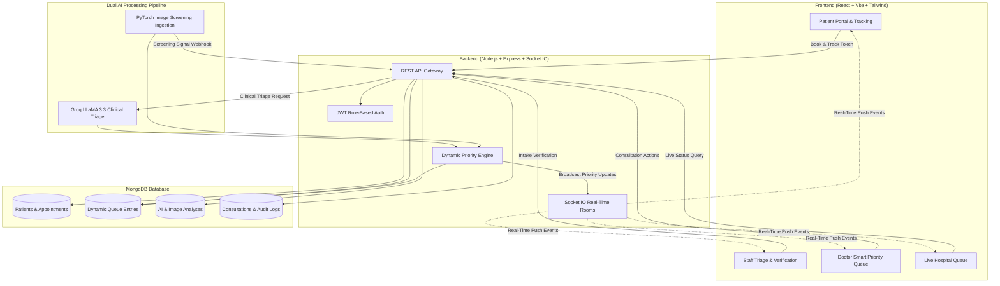

# Aarogya Pravah AI — AI-Powered Smart Patient Queue Management System

A production-grade, clinical-grade intelligent queue management system built for high-stakes hospital environments. **Aarogya Pravah AI** combines **Groq LLaMA 3.3 LLM triage parsing**, **PyTorch radiological screening ingestion**, and a **dynamic multi-factor priority scoring engine** connected in real-time over **Socket.IO** with a specialized **React + Tailwind** healthcare frontend.

---

## 🏛️ System Architecture



---

## 🚀 Key Features

1. **Patient Self-Check-in & Digital Token Generation**:
   - Fast appointment registration with structured symptoms, self-assessed severity, accidental trauma flag, and optional medical X-ray scan upload (`multipart/form-data`).
   - Instant token number generation (e.g. `EMG-20260822-4819`, `TKN-20260822-8022`).
2. **Privacy-Safe Real-Time Token Tracker**:
   - Patients track live queue position, estimated waiting time, and triage progression steps.
   - Strictly hides private medical notes and details of other waiting patients.
   - Real-time alerts when a doctor calls the token to proceed to a consultation room.
3. **Staff Triage & Human-in-the-Loop Verification**:
   - Real-time intake notification stream over Socket.IO (`join_staff`).
   - Staff review symptoms, inspect uploaded high-res X-rays in a lightbox viewer, adjust clinical severity (`CRITICAL`, `HIGH`, `MEDIUM`, `LOW`), request clarification, or verify check-in.
4. **Groq LLaMA 3.3 Clinical AI Triage**:
   - Zero-direct frontend exposure (API keys safely secured on backend).
   - Generates clinical urgency score, risk category, risk factors, and recommended priority level.
   - Clearly stamped with non-diagnostic disclaimer: *"AI-generated decision support — not a medical diagnosis."*
5. **PyTorch Medical Image Screening Ingestion**:
   - Dedicated webhook (`POST /api/ai/image-analysis-result`) for Python + PyTorch deep learning models (DenseNet/ResNet).
   - Ingests image abnormality score (0.0–1.0), confidence signal, and radiological findings, automatically updating patient priority score.
6. **Multi-Factor Dynamic Smart Priority Engine**:
   - Computes composite priority score:
     $$\text{Priority Score} = S_{\text{AI}} + S_{\text{IMG}} + W_{\text{SEV}} + B_{\text{TRAUMA}} + W_{\text{WAIT}}$$
   - Includes anti-starvation waiting time aging compensation (+2 points per 10 minutes wait).
7. **Doctor Clinical Dashboard & Consultation Workflow**:
   - Role-protected clinical dashboard (`DOCTOR`).
   - Live waiting queue automatically sorted by composite priority score.
   - Full patient clinical file with Groq AI analysis, radiological scan viewer, and past visit timeline.
   - Doctor actions:
     - **Start Consultation**: Transitions status to `IN_CONSULTATION` and alerts patient over Socket.IO.
     - **Put On Hold (Pending Queue)**: Moves patient to `PENDING` with reason (e.g. sent for X-ray/labs).
     - **Resume from Hold**: Restores patient to active queue with an immediate **+35 Priority Boost**.
     - **Complete Consultation**: Records clinical observations, diagnosis, vitals, prescriptions (Rx), and duration.
8. **Real-Time WebSockets Architecture**:
   - Room-based targeting (`staff`, `doctor`, `department:<dept>`, `patient:<tokenNumber>`).
   - Zero manual page reloads needed when new patients arrive, priorities change, or appointments complete.

---

## 📁 Repository Structure

```text
Aarogya Pravah AI/
├── backend/
│   ├── src/
│   │   ├── config/             # DB, Groq & Priority engine configuration
│   │   ├── controllers/        # Express route controllers (Auth, Patient, Staff, Doctor, Queue, AI)
│   │   ├── middleware/         # Auth JWT, Multer uploads, Error handling, Express validation
│   │   ├── models/             # Mongoose schemas (User, Patient, Appointment, QueueEntry, etc.)
│   │   ├── routes/             # REST API route definitions
│   │   ├── services/           # Groq AI, Priority scoring, Queue management, Audit logs
│   │   ├── sockets/            # Socket.IO event handler & targeted emitter
│   │   ├── utils/              # Token generators, ApiResponse wrappers, Logger
│   │   ├── app.js              # Express application setup, CORS, security headers
│   │   └── server.js           # Server & Socket.IO initialization
│   ├── scripts/
│   │   ├── seed.js             # Demo database seeder with sample staff, doctors, and patients
│   │   └── testQueueFlow.js    # Automated 14-step integration test suite
│   ├── uploads/                # Static storage for uploaded medical images
│   ├── API_DOCUMENTATION.md    # Detailed backend API & Socket.IO specification
│   ├── package.json
│   └── .env.example
│
├── frontend/
│   ├── src/
│   │   ├── components/         # Navbar, Sidebar, ProtectedRoute, ImageModal, Loading
│   │   ├── context/            # AuthContext (JWT session & case-insensitive role check)
│   │   ├── hooks/              # useAuth, useSocket
│   │   ├── pages/
│   │   │   ├── auth/           # Login, Register
│   │   │   ├── patient/        # PatientPortal, NewAppointment, TrackAppointment, TokenDetails
│   │   │   ├── staff/          # StaffDashboard, StaffValidation, StaffProfile
│   │   │   ├── doctor/         # DoctorDashboard, DoctorPatientDetails
│   │   │   └── shared/         # TriageQueue, PatientHistory, AIInsights, ResetPassword
│   │   ├── services/           # apiClient, authService, appointmentService, staffService,
│   │   │                       # doctorService, queueService, aiService, socketService
│   │   ├── App.jsx             # React Router route definitions
│   │   ├── main.jsx
│   │   └── index.css           # Tailwind custom clinical theme
│   ├── package.json
│   └── .env.example
│
└── README.md
```

---

## ⚙️ Environment Configuration

### Backend (`backend/.env`)

Create `backend/.env` (or copy from `backend/.env.example`):

```ini
PORT=5000
NODE_ENV=development
MONGODB_URI=mongodb://127.0.0.1:27017/smart_queue_ai
JWT_SECRET=super_secret_smart_queue_jwt_key_hackathon_2026_change_in_production
JWT_EXPIRES_IN=7d
GROQ_API_KEY=your_groq_api_key_here
GROQ_MODEL=llama-3.3-70b-versatile
CLIENT_URL=http://localhost:5173
AVG_CONSULTATION_MINUTES=15
```

> *Note: If `GROQ_API_KEY` is not provided or set to a placeholder, the backend automatically uses intelligent clinical heuristic triage fallback so the system remains 100% operational offline.*

### Frontend (`frontend/.env`)

Create `frontend/.env` (or copy from `frontend/.env.example`):

```ini
VITE_API_URL=http://localhost:5000/api
VITE_SOCKET_URL=http://localhost:5000
```

---

## 🏃 Getting Started

### 1. Prerequisites
- [Node.js](https://nodejs.org/) (v18 or higher)
- [MongoDB](https://www.mongodb.com/) (running locally on port 27017 or MongoDB Atlas URI)

### 2. Backend Setup

```bash
cd backend
npm install

# Configure environment variables in backend/.env:
# CLOUDINARY_CLOUD_NAME=your_cloud_name
# CLOUDINARY_API_KEY=your_api_key
# CLOUDINARY_API_SECRET=your_api_secret
# CLOUDINARY_FOLDER=aarogya-pravah-ai/xrays
# PYTORCH_SERVICE_URL=http://localhost:8000

# (Optional) Seed demo users & sample patients
npm run seed

# Run automated integration test suite (14 test scenarios)
npm run test:flow

# Start backend dev server
npm run dev
```
*Backend runs on `http://localhost:5000`.*

### 3. Cloudinary Medical Image Storage Setup
1. Create a Cloudinary account at [cloudinary.com](https://cloudinary.com).
2. Obtain your **Cloud Name**, **API Key**, and **API Secret** from the Cloudinary Console.
3. Configure `backend/.env` with these server-side variables (never expose in client code):
   ```env
   CLOUDINARY_CLOUD_NAME=your_cloud_name
   CLOUDINARY_API_KEY=your_api_key
   CLOUDINARY_API_SECRET=your_api_secret
   CLOUDINARY_FOLDER=aarogya-pravah-ai/xrays
   ```
4. Uploaded X-rays are streamed directly to Cloudinary using in-memory buffers with privacy-safe public IDs (`xray_anon_...`).

### 4. Python + PyTorch ML Screening Service Contract
The Node.js backend communicates with the Python ML screening service via:
- **Environment Variable**: `PYTORCH_SERVICE_URL=http://localhost:8000`
- **Asynchronous Request** (`POST /api/v1/screen-xray`):
  ```json
  {
    "appointmentId": "60d0fe4f5311236168a109ca",
    "tokenNumber": "EMG-20260822-1032",
    "patientId": "60d0fe4f5311236168a109c9",
    "imageUrl": "https://res.cloudinary.com/.../xray.jpg",
    "imageId": "xray_109c9_1719283_a1b2c3d4",
    "requestId": "req_1719283_a109ca"
  }
  ```
- **Ingestion Webhook** (`POST /api/ai/image-analysis-result`):
  ```json
  {
    "tokenNumber": "EMG-20260822-1032",
    "screeningStatus": "MODERATE_FINDINGS",
    "imageScore": 0.78,
    "possibleFindings": ["Bilateral infiltrates", "Bronchial wall thickening"],
    "modelVersion": "pytorch-chest-xray-v2.1",
    "confidenceSignal": 0.92
  }
  ```

### 5. FastAPI TensorFlow/Keras Chest X-Ray ML Service Setup

```bash
cd ml-service
python -m venv venv

# Windows
venv\Scripts\activate

# Linux / macOS
source venv/bin/activate

pip install -r requirements.txt

# Start FastAPI ML Service on port 8001
uvicorn model_service:app --host 0.0.0.0 --port 8001
```
*ML service listens on `http://localhost:8001`.*

### 6. Frontend Setup

```bash
cd frontend
npm install

# Start Vite development server
npm run dev
```
*Frontend runs on `http://localhost:5173`.*

---

## 🔑 Default Seeded Demo Accounts

If you run `npm run seed` in `backend/`, the following demo accounts are available:

| Role | Email | Password | Department |
|---|---|---|---|
| **Hospital Staff** | `staff@aarogyapravah.ai` | `password123` | Emergency & Triage |
| **Doctor (Emergency)** | `dr.mehta@aarogyapravah.ai` | `password123` | Emergency |
| **Doctor (General Medicine)** | `dr.roy@aarogyapravah.ai` | `password123` | General Medicine |

---

## 🧪 Complete End-to-End Demo Workflow

1. **Patient Booking**:
   - Open `http://localhost:5173/`.
   - Fill in patient details (e.g. name: *Aarav Sharma*, age: 42, symptoms: *Severe crushing chest pain and shortness of breath*, department: *Emergency*, severity: *High*, attach X-ray).
   - Click **Generate Token**. Note the generated token number (e.g. `EMG-20260822-4819`).
2. **Patient Live Tracking**:
   - Navigate to **Track Appointment** (`/track-appointment`).
   - Enter token number to see real-time queue position and status progression.
3. **Staff Verification & AI Triage**:
   - Open an incognito/new window and navigate to `/login` (or `/staff/login`).
   - Log in as `staff@aarogyapravah.ai` / `password123`.
   - On the **Validation Queue**, click the new patient arrival.
   - Review reported symptoms, inspect the uploaded X-ray in full-screen lightbox, select clinical severity (`HIGH`), and click **Verify & Trigger AI Triage**.
   - Groq AI triage runs automatically and places the patient into the smart priority queue.
4. **Doctor Consultation**:
   - In another window, log in as `dr.mehta@aarogyapravah.ai` / `password123`.
   - Open **Doctor Dashboard** (`/doctor/dashboard`).
   - Observe the real-time priority queue sorted by composite score.
   - Click **Call / Consult** to start consultation (patient tracker immediately updates to *Serving Now*).
   - Enter diagnosis notes, vitals, prescriptions, and click **Complete Visit**.
5. **Pending Queue & Resume Boost**:
   - On Doctor Dashboard, click the **Pause** icon on a patient to put them on hold (e.g. *Sent for urgent scan*).
   - Switch to the **Pending / On Hold** tab.
   - Click **Resume (+35 Boost)**. Observe patient returned to the top of the waiting queue with restored priority boost.

---

## 🔒 Safety & Non-Diagnostic Disclaimer

Aarogya Pravah AI is designed as a **clinical decision support and queue optimization platform**. It does **NOT** provide a binding medical diagnosis, replace licensed medical practitioners, or make autonomous medical decisions. All clinical intake records require verification by qualified hospital staff before placement in consultation queues.

---

## 📄 License
MIT License. Developed for hackathon demonstration.